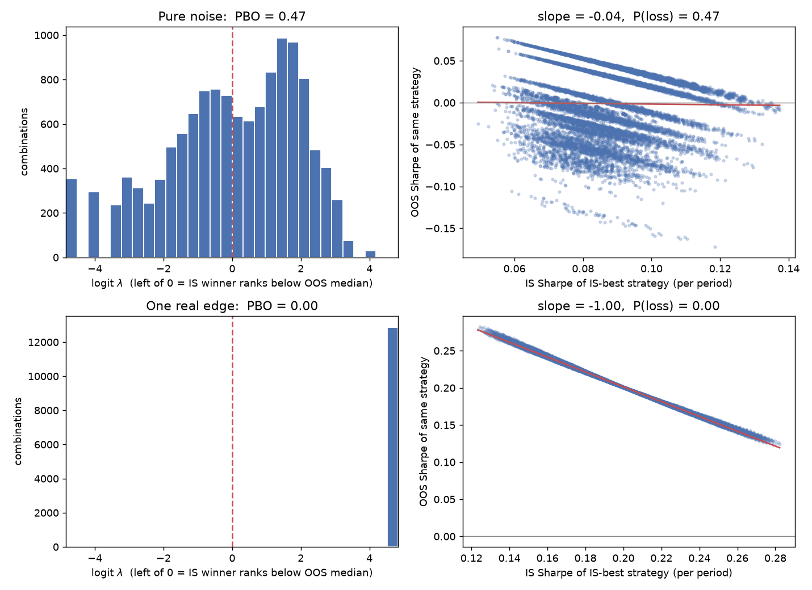

# overfit

**Is your best backtest real, or just the luckiest of N tries?**

A small Python library that answers that question with the methods of Marcos López de Prado:
the Probability of Backtest Overfitting (via CSCV), the Deflated Sharpe Ratio and the Minimum
Track Record Length. Dependencies: numpy, pandas, scipy.



*100 strategy configurations, 1,500 daily returns each. Top: pure noise. Bottom: the same noise
plus one configuration with a genuine edge (annual Sharpe about 3). Reproduce with
`uv run python examples/demo.py`.*

| | PBO | best config, annualised Sharpe | expected max Sharpe of 100 noise trials | DSR |
|---|---|---|---|---|
| Pure noise | 0.47 | 1.02 | 0.96 | 0.56 (not significant) |
| One real edge | 0.00 | 3.21 | 1.26 | 1.00 (significant) |

The luckiest noise configuration has a PSR of 0.99, which looks like proof of skill until you
account for having tried 100 things. Across 40 random noise matrices, the mean PBO is 0.50 and the
DSR never exceeds 0.95.

## Install and quickstart

```bash
uv add git+https://github.com/CH4RL3I/backtest-overfitting   # or: pip install -e .
```

```python
import pandas as pd
from overfit import cscv_pbo, deflated_sharpe_best, min_track_record_length

returns = pd.read_csv("returns.csv", index_col=0)      # T rows (periods) x N columns (configs)

pbo = cscv_pbo(returns, n_blocks=16)                    # C(16, 8) = 12,870 IS/OOS splits
print(pbo.pbo, pbo.prob_loss, pbo.degradation_slope)

dsr = deflated_sharpe_best(returns)                     # best config, deflated for N trials
print(dsr.best, dsr.sharpe, dsr.sr0, dsr.dsr)
```

Command line (non-numeric columns such as dates are ignored):

```bash
overfit report returns.csv --blocks 16 --periods-per-year 252
```

prints the PBO, the probability of OOS loss, the degradation slope, the best strategy's PSR and
DSR, and the Minimum Track Record Length against both 0 and the deflated benchmark.

## Metrics

Throughout, SR is the **per-period** Sharpe ratio (mean over sample standard deviation of the
returns as sampled). Nothing is annualised internally. To annualise for display multiply by
$\sqrt{\text{periods per year}}$; to express an annual benchmark per period, divide by it.

### Probability of Backtest Overfitting

Bailey, Borwein, López de Prado and Zhu (2016). Split the $T \times N$ return matrix into $S$
blocks. For each of the $\binom{S}{S/2}$ ways to pick half the blocks as in-sample (IS), the
rest are out-of-sample (OOS). Let $n^*$ be the configuration with the best IS Sharpe, and
$\omega = \text{rank}_{\text{OOS}}(n^*)/(N+1)$ its relative OOS rank. Then

$$\lambda = \ln\frac{\omega}{1-\omega}, \qquad \text{PBO} = \Pr[\lambda \le 0].$$

PBO is the share of splits in which the IS winner ends up at or below the OOS median. Pure
selection from noise gives about 0.5. The result also carries the full $\lambda$ distribution,
the regression of the winner's OOS Sharpe on its IS Sharpe (performance degradation) and
$\Pr[\text{OOS Sharpe} < 0]$ (probability of loss).

### Probabilistic and Deflated Sharpe Ratio

Bailey and López de Prado (2014). With $\hat\gamma_3$ the skewness and $\hat\gamma_4$ the
(non-excess) kurtosis of the returns and $T$ the number of observations,

$$\text{PSR}(SR^*) = \Phi\!\left(\frac{(\widehat{SR}-SR^*)\sqrt{T-1}}{\sqrt{1-\hat\gamma_3\widehat{SR}+\frac{\hat\gamma_4-1}{4}\widehat{SR}^2}}\right).$$

The DSR is the PSR evaluated at the Sharpe ratio one would expect from the best of $N$
skill-free trials,

$$SR_0=\sqrt{V[\widehat{SR}_n]}\left((1-\gamma)\,\Phi^{-1}\!\left(1-\tfrac1N\right)+\gamma\,\Phi^{-1}\!\left(1-\tfrac1{Ne}\right)\right),\qquad \text{DSR}=\text{PSR}(SR_0),$$

where $\gamma\approx0.5772$ is the Euler-Mascheroni constant and $V[\widehat{SR}_n]$ is the
cross-sectional variance of the $N$ trials' Sharpe ratios. DSR is a probability that the true
Sharpe exceeds $SR_0$; values above 0.95 are significant at the 5% level.

### Minimum Track Record Length

Same framework: the number of observations needed for the PSR against $SR^*$ to reach
$1-\alpha$,

$$\text{MinTRL} = 1 + \left(1-\hat\gamma_3\widehat{SR}+\frac{\hat\gamma_4-1}{4}\widehat{SR}^2\right)\left(\frac{\Phi^{-1}(1-\alpha)}{\widehat{SR}-SR^*}\right)^2,$$

in periods, and infinite when $\widehat{SR}\le SR^*$.

## Validation

`uv run pytest` runs 30 tests, including: PSR, MinTRL and $SR_0$ against hand-computed values;
100 noise configurations (mean PBO about 0.5, DSR not significant); a matrix with one drifting
configuration (PBO near 0, DSR significant); the sign convention of $\lambda$; and edge cases
(odd $S$, $N=1$, constant returns, NaNs, too-short input).

## Limitations

- **Independent trials assumed.** $SR_0$ uses $N$ independent trials. Real parameter grids are
  highly correlated, so the effective number of trials is smaller and the DSR is conservative.
  Estimate the effective $N$ yourself (e.g. by clustering) and use `deflated_sharpe_ratio` with
  your own `n_trials` and `sr_variance`.
- **Only the trials you pass in count.** Strategies you discarded before this matrix was built
  do not enter PBO or DSR. The tests measure selection bias among what you show them.
- **CSCV needs stationarity and i.i.d.-like blocks.** Blocks are contiguous but treated as
  exchangeable; serial correlation or regime changes bias the result. PBO says nothing about
  look-ahead bias, transaction costs or data errors.
- **Single-sample noise.** For one noise matrix PBO ranges roughly from 0.2 to 0.8; treat it as
  an estimate, not an exact probability.
- **Degradation slope is mechanically negative** when one strategy wins nearly every split
  (IS and OOS halves are complements, so their Sharpes trade off). Read it together with PBO.
- **Sharpe ranking only.** The performance measure is the Sharpe ratio; flat (zero-variance)
  strategies get Sharpe 0. If $T$ is not divisible by $S$, the oldest rows are dropped.
- `N=1` raises in `cscv_pbo` (no selection to overfit); `deflated_sharpe_best` then reduces to the PSR against 0.

## References

- Bailey, D. H., Borwein, J. M., López de Prado, M., Zhu, Q. J. (2016). *The Probability of
  Backtest Overfitting.* Journal of Computational Finance 20(4), 39-69.
- Bailey, D. H., López de Prado, M. (2014). *The Deflated Sharpe Ratio: Correcting for
  Selection Bias, Backtest Overfitting and Non-Normality.* Journal of Portfolio Management
  40(5), 94-107.
- Bailey, D. H., López de Prado, M. (2012). *The Sharpe Ratio Efficient Frontier.* Journal of
  Risk 15(2), 3-44 (PSR and MinTRL).

## License

MIT, © 2026 Emilio Gappa.
